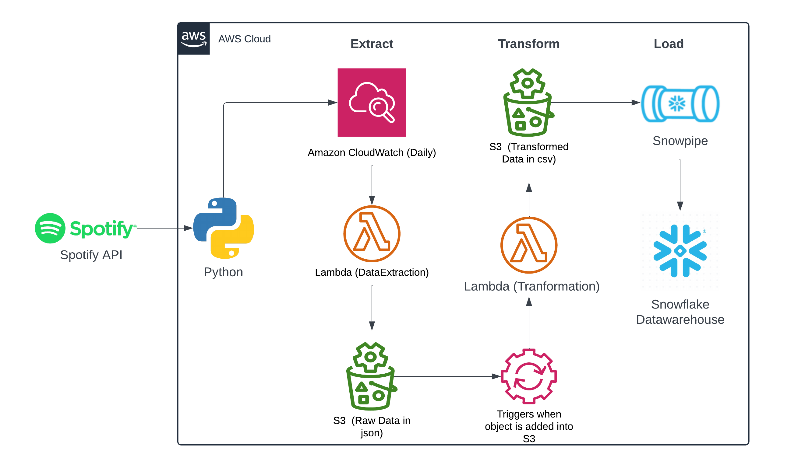

# Spotify Data Engineering with Snowflake

This project leverages Snowflake as the data warehouse solution for the loading and processing stages, while maintaining the core architecture from the previous project [`spotify-data-analysis-etl-python-aws`](https://github.com/your_username/spotify-data-analysis-etl-python-aws). 

## Project Overview
This project is designed to efficiently handle and transform Spotify's top 50 song data by using Snowflake’s robust data warehousing capabilities. We implemented Snowflake to load and manage data transformations, establishing a seamless flow from data ingestion in AWS S3 through to processing and storage in Snowflake.  

## Key Enhancements
### 1. **Optimized File Processing**
   - **Efficient File Selection**: The code now processes only the most recent file in the data pipeline, reducing duplication and maintaining a focus on the latest top 50 songs. Before each execution, any files in the `to_process/` directory are moved to `to_processed/`.
   - **File Retention**: Processed files are organized into their respective folders (`album_data/`, `artist_data/`, `song_data/`) to retain only the latest records. Existing csv files will be deleted in the respective folders before creation of new csv file. The moto is to only consider fresh data.

### 2. **Updated Data Loading with Snowflake Integration**
   - **Snowflake Table Creation**: Relevant tables were created within Snowflake to store the data for albums, artists, and songs.
   - **S3-Snowflake Integration**: Established a Storage Integration between AWS S3 and Snowflake to streamline data movement and security.
   - **Stage and Snowpipe Setup**: Configured file format, stage, and Snowpipe within Snowflake. A notification event was added in the S3 bucket properties to trigger Snowpipe whenever a new file is uploaded, automatically loading data into Snowflake tables.

### 3. **Automated Data Truncation**
   - **Stored Procedures and Task Scheduling**: Created a stored procedure to automatically truncate the `album_data`, `artist_data`, and `song_data` tables before new data ingestion. The stored procedure is invoked by a Snowflake task, which is scheduled to execute a few minutes before the `spotify-data-extract` Lambda function runs.
   - **Scheduling Tips**: Ensure the Snowflake's task to be scheduled before triggering CloudWatch event's schedule for `spotify-data-extract` to maintain data consistency and avoid duplicate entries.

Refer to the following files for more details on the code:
- [`Spotify_Snwflk_Transform@lambda.py`](./Spotify_Snwflk_Transform@lambda.py) for recent file processing code.
- [`Spotify_Snwflk.sql`](./Spotify_Snwflk.sql) for Snowflake table and task setup code.
